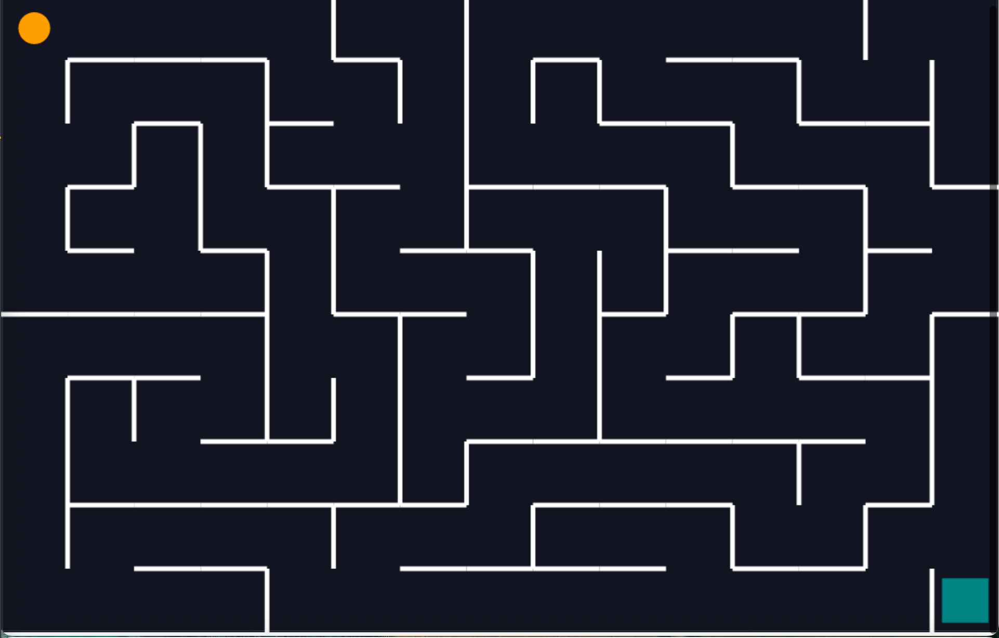
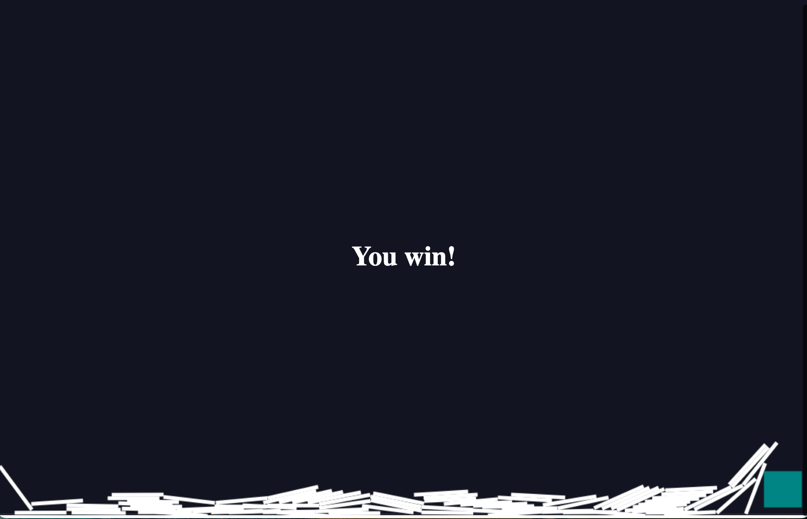

# Maze Game
## Description
This is a simple Javascript based game, which generates a maze on random, using Ellers Algorithm.

The Player can move through the maze using the arrow keys.

The game is won, when the player touches the green square.

The game looks like this:

When the player wins the game, the game looks like this:

## How to play
1. Download the repository
2. Open the index.html file in your browser
3. Use the arrow keys to move through the maze, until the circle touches the green square
